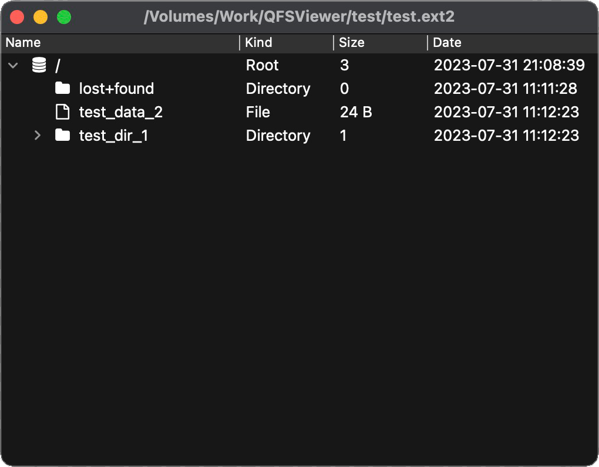

# QFSViewer

English | [简体中文](./README_zh_CN.md)

QFSViewer is a small tool for developers to view the contents of various file system raw image files, which does not rely on the operating system mounting, does not require permission requests, and is completed entirely within the software application. Based on this feature, the tool can easily run on windows/linux/macos, and even other embedded systems. The tool is based on Qt, some code comes from other open source projects, the project fully complies with their corresponding open source agreements, attached at the end of the reference, hereby thanks. The tool interface is simple and clear, easy to operate, the main interface is as follows:

## Feature

1. Select the path where the file system raw image file to be opened is located.
2. Click the confirm button to complete the loading and display the file system contents.

## Format

Currently supported formats include:

jffs2\fat12\fat16\fat32\exfat\ext4\ext3\ext2

## Contributing

If you have suggestions or ideas for this project, please submit issues and pull requests on GitHub or Gitee.

The current project is recommended to use version Qt6.2.0 or higher.

## Thanks

- [QFontIcon](https://github.com/dridk/QFontIcon)
- [lwext4](https://github.com/gkostka/lwext4)
- [ff15](http://elm-chan.org/fsw/ff/00index_e.html)
- [jffs2extract](https://github.com/rickardp/jffs2extract)
- [treemodel.cpp](https://github.com/chocoball/QTreeViewTest)
