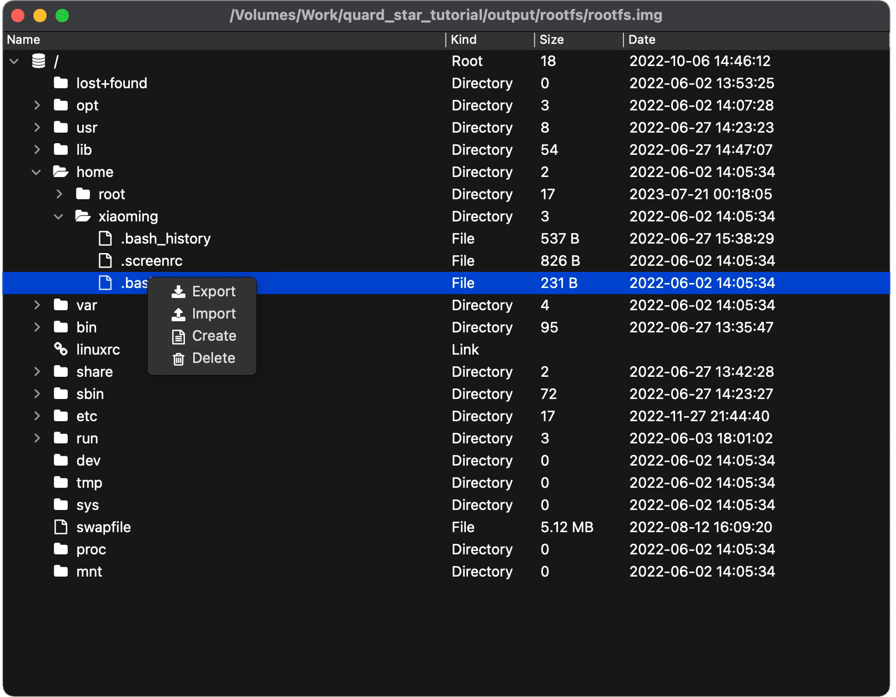

# QFSViewer

[🇺🇸 English](./README.md) | 🇨🇳 简体中文

QFSViewer一款用于开发人员查看各种文件系统原始映像文件内容的小工具，特点是不需要依赖操作系统挂载，不需要权限申请，全部在软件应用内完成，基于此特点，该工具可以轻松运行在windows/linux/macos，甚至其他嵌入式系统。该工具基于Qt，部分代码来源自其他开源项目，项目完全遵守其对应的开源协议，文末附上引用，特此感谢。该工具界面简单清晰，操作便携，主界面如下：

## 功能描述

1. 选择要打开的文件系统原始映像文件所在路径。
2. 点击确认按钮，完成加载并显示文件系统内容。
3. 右键点击文件，可以导出文件。
4. 右键点击文件/目录，可以导入文件，新建目录，删除目录（这些功能是实验性的，因为可能会破坏原image文件，使用前请务必备份）。

## 格式支持

目前支持格式包括：

jffs2\fat12\fat16\fat32\exfat\ext4\ext3\ext2

## 编译说明

　> [编译说明](./DEVELOPNOTE.md)

## 贡献

如果您对本项目有建议或想法，欢迎在GitHub或Gitee上提交issue和pull requests。

目前项目建议使用版本Qt6.5.0或更高版本。

## 感谢

- [QDarkStyleSheet](https://github.com/ColinDuquesnoy/QDarkStyleSheet)
- [QFontIcon](https://github.com/dridk/QFontIcon)
- [lwext4](https://github.com/gkostka/lwext4)
- [ff15](http://elm-chan.org/fsw/ff/00index_e.html)
- [jffs2extract](https://github.com/rickardp/jffs2extract)
- [treemodel.cpp](https://github.com/chocoball/QTreeViewTest)
